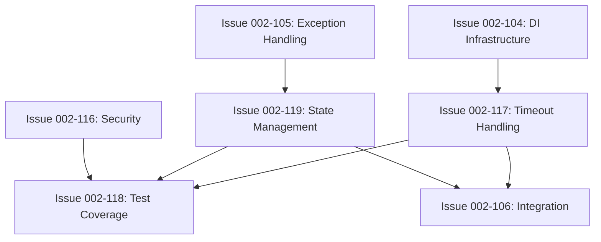

# Code Quality Sprint Planning - Post-Critical Issues Resolution

**Date**: 2025-08-15  
**Status**: Planning Phase  
**Context**: Critical production-blocking issues resolved, planning remaining quality improvements

## Executive Summary

Following successful resolution of 4 critical production-blocking issues, this document outlines the sprint planning for the 4 remaining major code quality improvements identified during comprehensive code review. These issues are prioritized based on risk, dependencies, and integration with existing project milestones.

## Resolved Critical Issues (✅ COMPLETED)

1. **Thread Safety Violation** - AdaptiveChunkOptimizer (RESOLVED)
2. **Resource Leak Risk** - SimpleRawRepl disposal (RESOLVED)  
3. **Error Classification False Positives** - ExecutionErrorParser (RESOLVED)
4. **Prompt State Race Conditions** - atPrompt field (RESOLVED)

## Remaining Quality Issues - Sprint Allocation

### Sprint 6: Infrastructure Hardening (Week 3-4 of v0.2.0)
**Theme**: Reliability and State Management  
**Duration**: 1 week  
**Total Story Points**: 13

#### Issue 002-117: Timeout Handling Standardization
- **Story Points**: 5
- **Priority**: HIGH
- **Dependencies**: DI Infrastructure (Issue 002-104)
- **Risk**: Operations hanging in production
- **Assignment**: Senior Developer

#### Issue 002-119: Protocol State Management Vulnerabilities  
- **Story Points**: 8
- **Priority**: HIGH
- **Dependencies**: Exception Handling (Issue 002-105)
- **Risk**: Device communication failures
- **Assignment**: Senior Developer + Protocol Expert

**Sprint 6 Goals:**
- Establish reliable timeout handling across all operations
- Implement robust state machine for protocol management
- Zero hanging operations in stress tests
- Foundation for reliable device communication

### Sprint 7: Security Enhancement (Week 5 of v0.2.0)
**Theme**: Security and Input Validation  
**Duration**: 1 week  
**Total Story Points**: 8

#### Issue 002-116: Input Validation and Command Injection Protection
- **Story Points**: 8
- **Priority**: HIGH
- **Dependencies**: None (can start immediately)
- **Risk**: Security vulnerabilities in production IoT
- **Assignment**: Security-Focused Developer

**Sprint 7 Goals:**
- Comprehensive input validation framework
- Command injection protection
- Security policy configuration
- Zero security vulnerabilities in penetration testing

### Sprint 8: Quality Assurance Focus (Week 6-7 of v0.2.0)
**Theme**: Comprehensive Testing and Validation  
**Duration**: 2 weeks  
**Total Story Points**: 13

#### Issue 002-118: Comprehensive Test Coverage for Error Scenarios
- **Story Points**: 13
- **Priority**: MEDIUM-HIGH
- **Dependencies**: Issues 002-110, 002-117, 002-119
- **Risk**: Undetected regressions
- **Assignment**: QA Engineer + Test Automation Specialist

**Sprint 8 Goals:**
- 95% error path code coverage
- 165+ new test cases
- Stress testing framework
- Error injection capabilities
- CI/CD integration complete

## Prioritization Rationale

### Risk-Based Prioritization

1. **Infrastructure First (Sprint 6)**
   - Timeout and state management are foundational
   - Affect all other operations
   - Required for reliable testing
   - Highest impact on system stability

2. **Security Second (Sprint 7)**
   - Critical for production deployment
   - Independent implementation possible
   - Clear scope and requirements
   - Regulatory/compliance considerations

3. **Testing Last (Sprint 8)**
   - Requires stable infrastructure
   - Benefits from completed improvements
   - Validates all previous work
   - Comprehensive coverage needs time

### Dependency Analysis

## Resource Allocation

### Sprint 6 (Infrastructure Hardening)
- **Lead**: Senior Developer
- **Support**: Protocol Expert
- **Focus**: Reliability foundations
- **Review**: Architecture Team

### Sprint 7 (Security Enhancement)
- **Lead**: Security Developer
- **Support**: Code Reviewer
- **Focus**: Security framework
- **Review**: Security Expert

### Sprint 8 (Quality Assurance)
- **Lead**: QA Engineer
- **Support**: Test Automation Specialist
- **Focus**: Comprehensive validation
- **Review**: Entire Team

## Integration with Existing Milestones

### Milestone v0.2.0: Architectural Improvements
These quality issues integrate into the existing milestone structure:

- **Phase 1 (Weeks 1-2)**: Core Foundation
  - Existing architectural issues
  
- **Phase 2 (Weeks 3-4)**: Infrastructure Hardening
  - ➕ Issue 002-117: Timeout Handling
  - ➕ Issue 002-119: State Management
  
- **Phase 3 (Week 5)**: Security and Integration
  - ➕ Issue 002-116: Input Validation
  - Existing integration work
  
- **Phase 4 (Weeks 6-7)**: Testing and Validation
  - ➕ Issue 002-118: Comprehensive Testing
  - Existing test infrastructure

## Risk Matrix

| Issue | Technical Risk | Business Risk | Mitigation Strategy |
|-------|---------------|---------------|-------------------|
| 002-117 | Medium - Complex async patterns | High - Operations hanging | Incremental implementation, extensive testing |
| 002-119 | High - State machine complexity | High - Communication failures | Formal verification, recovery mechanisms |
| 002-116 | Medium - Security patterns | Critical - Security breach | Security review, penetration testing |
| 002-118 | Low - Well-understood domain | Medium - Undetected bugs | Systematic coverage, automation |

## Success Metrics

### Sprint 6 Success Criteria
- [ ] Zero timeout-related hangs in 24-hour test
- [ ] 100% state transitions validated
- [ ] 90% automatic recovery success
- [ ] <5ms overhead per operation

### Sprint 7 Success Criteria
- [ ] Zero security vulnerabilities found
- [ ] 100% input validation coverage
- [ ] Security policies configurable
- [ ] <5ms validation overhead

### Sprint 8 Success Criteria
- [ ] 95% error path coverage
- [ ] 165+ test cases added
- [ ] Zero flaky tests
- [ ] <30 minute test execution

## Quality Gates

### Pre-Sprint Requirements
Each sprint must have:
- Clear acceptance criteria
- Test plans defined
- Dependencies resolved
- Resources allocated

### Mid-Sprint Checkpoints
- Daily progress review
- Blocker identification
- Risk assessment update
- Scope validation

### Sprint Completion Gates
- All acceptance criteria met
- Code review completed
- Tests passing in CI
- Documentation updated
- Performance validated

## Recommendations

### Immediate Actions
1. **Assign Sprint Leads**: Identify developers for each sprint theme
2. **Dependency Resolution**: Ensure Issues 002-104 and 002-105 complete on schedule
3. **Environment Setup**: Prepare test environments for each sprint
4. **Tool Procurement**: Acquire security scanning and load testing tools

### Process Improvements
1. **Pair Programming**: For complex state machine and security work
2. **Code Review Focus**: Dedicated review time for each issue
3. **Testing First**: Write tests before implementation where possible
4. **Documentation**: Update as part of implementation, not after

### Risk Mitigation
1. **Buffer Time**: Each sprint has buffer for unexpected complexity
2. **Parallel Work**: Some issues can progress in parallel
3. **Early Integration**: Integrate changes frequently to detect issues
4. **Rollback Plan**: Ability to revert if issues arise

## Long-Term Benefits

### Technical Debt Reduction
- Elimination of major reliability risks
- Improved maintainability
- Better debugging capabilities
- Reduced support burden

### Production Readiness
- Security hardening for IoT deployment
- Reliability for mission-critical applications
- Comprehensive test coverage
- Clear operational boundaries

### Developer Experience
- Predictable timeout behavior
- Clear error messages
- Robust recovery mechanisms
- Comprehensive test suite

## Conclusion

The four remaining code quality issues represent important but non-blocking improvements that will significantly enhance the production readiness of Belay.NET. By integrating them into the existing v0.2.0 milestone structure across Sprints 6-8, we can address these issues systematically while maintaining project momentum.

The prioritization ensures foundational reliability improvements come first, followed by security hardening, and culminating in comprehensive validation. This approach minimizes risk while maximizing the value delivered in each sprint.

**Next Steps:**
1. Review and approve sprint allocation with team
2. Assign developers to each issue
3. Begin Sprint 6 planning session
4. Update project board with new issues
5. Communicate timeline to stakeholders