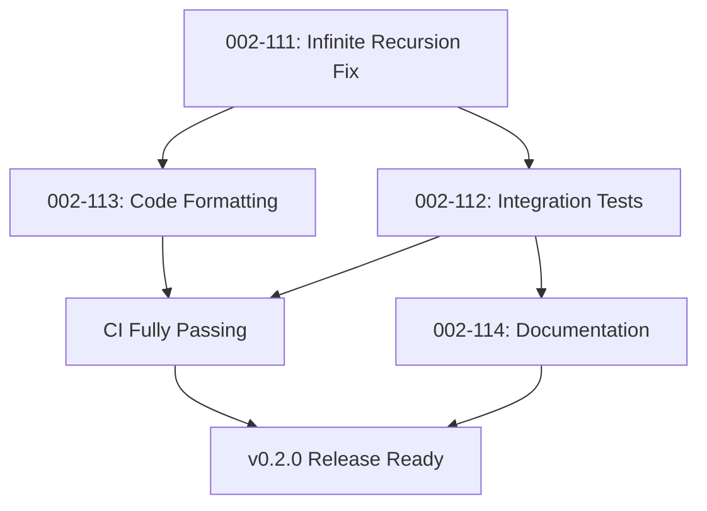

# Critical Issues Priority Plan - Post-Session Management Refactoring

**Date**: 2025-08-12  
**Status**: 🚨 CI BLOCKED - URGENT ACTION REQUIRED  
**Context**: Session management refactoring complete but CI is failing

## Executive Summary

The session management refactoring is functionally complete with 95.9% local test pass rate, but CI is completely blocked due to critical issues. This plan outlines the prioritized approach to restore CI functionality and complete the architectural improvements.

## Current State

### ✅ Completed
- Session management refactoring (Issue 002-102)
- CI compilation errors fixed
- Documentation site deployment restored

### 🚨 Critical Blockers
1. **Infinite recursion** in enhanced executor (stack overflow in CI)
2. **Integration tests disabled** (5 test files renamed to .disabled)
3. **Code formatting violations** (60+ files)
4. **Outdated documentation** (architecture changes not reflected)

## Priority Order and Timeline

### Week 1: CI Restoration (CRITICAL PATH)

#### Day 1-2: Issue 002-111 - Fix Infinite Recursion (CRITICAL)
**Status**: 🚨 IMMEDIATE ACTION REQUIRED  
**Why First**: Blocks all CI/CD operations  
**Approach**:
- Add recursion detection guard
- Fix executor delegation chain
- Break circular dependency between EnhancedExecutor and SimplifiedTaskExecutor

**Success Metric**: CI unit tests pass without stack overflow

#### Day 3: Issue 002-113 - Code Formatting Cleanup (HIGH)
**Status**: ⏳ READY TO START  
**Why Second**: Quick win, unblocks CI quality gate  
**Approach**:
- Run `dotnet format` on entire solution
- Fix StyleCop violations
- Update .editorconfig

**Success Metric**: `dotnet format --verify-no-changes` passes

### Week 2: Test Infrastructure Restoration

#### Day 4-7: Issue 002-112 - Integration Test Restoration (HIGH)
**Status**: ⏳ BLOCKED BY 002-111  
**Why Third**: Critical for regression prevention  
**Approach**:
- Update tests for new session management
- Fix Belay.Tests.Infrastructure
- Re-enable tests incrementally

**Success Metric**: All .disabled files restored and passing

### Week 3: Documentation and Stabilization

#### Day 8-10: Issue 002-114 - Documentation Update (MEDIUM)
**Status**: ⏳ BLOCKED BY 002-111, 002-112  
**Why Last**: Requires stable architecture  
**Approach**:
- Update architecture documentation
- Fix code examples
- Complete relevant placeholder pages

**Success Metric**: Documentation accurate and examples working

## Technical Dependencies



## Risk Matrix

| Issue | Risk Level | Impact | Mitigation |
|-------|-----------|--------|------------|
| 002-111 | CRITICAL | CI completely blocked | Immediate focus, pair programming if needed |
| 002-112 | HIGH | No integration testing | Incremental restoration, temporary workarounds |
| 002-113 | MEDIUM | CI quality gate fails | Automated tooling, one-time effort |
| 002-114 | LOW | User confusion | Can be updated post-release if needed |

## Resource Allocation

### Immediate (Day 1-2)
- **Primary Focus**: Issue 002-111 (Infinite Recursion)
- **Approach**: Single developer, deep focus
- **Support**: Code review from principal-code-reviewer agent

### Short-term (Day 3-7)
- **Parallel Work**: 
  - Developer 1: Issue 002-112 (Integration Tests)
  - Developer 2: Issue 002-113 (Code Formatting)
- **Coordination**: Daily sync on test infrastructure

### Medium-term (Day 8-10)
- **Documentation Sprint**: Issue 002-114
- **Review**: Architecture review with stakeholders

## Success Criteria Checklist

### Phase 1: CI Restoration ✅
- [ ] No stack overflow errors in CI
- [ ] All unit tests passing
- [ ] Code formatting checks pass
- [ ] CI pipeline fully green

### Phase 2: Test Infrastructure ✅
- [ ] All integration tests re-enabled
- [ ] Subprocess tests working
- [ ] Performance benchmarks running
- [ ] >90% code coverage maintained

### Phase 3: Documentation ✅
- [ ] Architecture docs updated
- [ ] Migration guide complete
- [ ] Code examples validated
- [ ] Placeholder pages updated

## Monitoring and Validation

### Daily Checks
```bash
# CI Status
dotnet test --filter "FullyQualifiedName~EnhancedExecutor"

# Format Status  
dotnet format --verify-no-changes

# Integration Test Status
ls tests/**/*.disabled 2>/dev/null | wc -l  # Should be 0
```

### Progress Tracking
- Daily status updates in this document
- CI dashboard monitoring
- Test coverage reports
- Documentation build status

## Escalation Path

If blockers arise:
1. **Day 1-2**: If recursion fix proves complex, consider temporary test disabling
2. **Day 3-5**: If integration tests have deep issues, prioritize critical paths only
3. **Day 6+**: If timeline slips, consider partial release with known issues documented

## Next Steps After Completion

Once all critical issues are resolved:
1. Complete remaining Issue 002-XXX architectural improvements
2. Begin Epic 004: Proxy Objects Implementation
3. Plan v0.2.0 release
4. Update roadmap for v0.3.0

## Notes

**Critical Success Factor**: Issue 002-111 (Infinite Recursion) must be resolved first. No other work should proceed until CI is unblocked.

**Communication**: Daily updates on progress, immediate escalation if blockers found.

**Quality Gate**: Do not proceed to next issue until current issue fully resolved and CI passing.