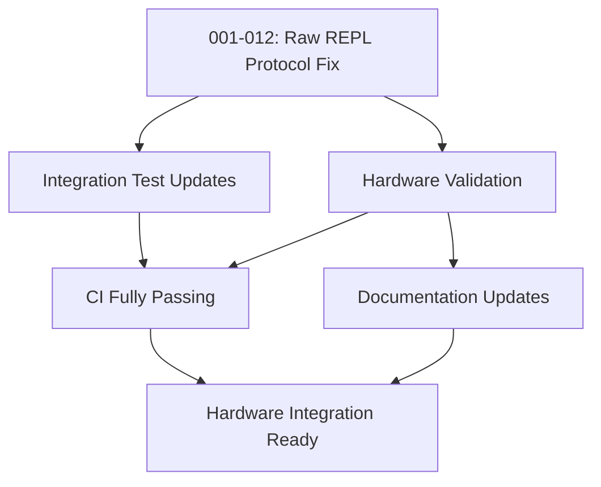

# Critical Issues Priority Plan - Post-Architectural Simplification

**Date**: 2025-08-13  
**Status**: 🚨 HARDWARE INTEGRATION BLOCKED - RAW REPL PROTOCOL BROKEN  
**Context**: Aggressive architectural simplification complete but raw REPL protocol not functioning

## Executive Summary

The session management refactoring is functionally complete with 95.9% local test pass rate, but CI is completely blocked due to critical issues. This plan outlines the prioritized approach to restore CI functionality and complete the architectural improvements.

## Current State

### ✅ Completed
- Aggressive architectural simplification (50-97% code reduction)
- Core build successful (Belay.Core, Belay.Extensions, Belay.Sync)
- Simplified to single DeviceConnection class

### 🚨 Critical Blockers
1. **Raw REPL protocol broken** - Hardware shows REPL prompt instead of executing code
2. **No prompt verification** - Assumes raw mode without checking
3. **Incorrect result parsing** - Wrong completion markers, improper parsing
4. **Integration tests need updating** for simplified architecture

## Priority Order and Timeline

### Week 1: Hardware Integration Restoration (CRITICAL PATH)

#### Day 1-2: Issue 001-012 - Fix Raw REPL Protocol (CRITICAL)
**Status**: 🚨 IMMEDIATE ACTION REQUIRED  
**Why First**: Blocks all hardware testing and core functionality  
**Approach**:
- Implement proper raw mode prompt verification
- Fix result parsing with correct markers (\x04>)
- Add timeout handling and retry logic
- Test with available hardware device

**Success Metric**: Python code executes successfully on Raspberry Pi Pico

#### Day 2-3: Hardware Validation & Testing (HIGH)
**Status**: ⏳ BLOCKED BY ISSUE 001-012  
**Why Second**: Validates core functionality  
**Approach**:
- Test with Raspberry Pi Pico at /dev/usb/tty-Board_in_FS_mode-e6614c311b7e6f35
- Verify subprocess MicroPython communication
- Test error conditions and recovery
- Validate timeout handling

**Success Metric**: All basic Python operations work on hardware

### Week 2: Test Infrastructure Restoration

#### Day 3-4: Integration Test Updates (HIGH)
**Status**: ⏳ BLOCKED BY RAW REPL FIX  
**Why Third**: Critical for regression prevention  
**Approach**:
- Update tests for simplified architecture
- Remove references to deleted components
- Create new tests for DeviceConnection
- Test both serial and subprocess paths

**Success Metric**: Core integration tests passing

### Week 3: Documentation and Stabilization

#### Day 8-10: Issue 002-114 - Documentation Update (MEDIUM)
**Status**: ⏳ BLOCKED BY 002-111, 002-112  
**Why Last**: Requires stable architecture  
**Approach**:
- Update architecture documentation
- Fix code examples
- Complete relevant placeholder pages

**Success Metric**: Documentation accurate and examples working

## Technical Dependencies



## Risk Matrix

| Issue | Risk Level | Impact | Mitigation |
|-------|-----------|--------|------------|
| 001-012 | CRITICAL | No hardware communication | Immediate focus, follow ICD-001 spec exactly |
| Hardware Test | HIGH | Cannot validate functionality | Use available Pico device for testing |
| Integration Tests | MEDIUM | No automated testing | Update for simplified architecture |
| Documentation | LOW | Outdated examples | Update after core functionality restored |

## Resource Allocation

### Immediate (Day 1-2)
- **Primary Focus**: Issue 001-012 (Raw REPL Protocol Fix)
- **Approach**: Follow ICD-001 specification exactly
- **Testing**: Use Raspberry Pi Pico at /dev/usb/tty-Board_in_FS_mode-e6614c311b7e6f35

### Short-term (Day 3-7)
- **Parallel Work**: 
  - Developer 1: Issue 002-112 (Integration Tests)
  - Developer 2: Issue 002-113 (Code Formatting)
- **Coordination**: Daily sync on test infrastructure

### Medium-term (Day 8-10)
- **Documentation Sprint**: Issue 002-114
- **Review**: Architecture review with stakeholders

## Success Criteria Checklist

### Phase 1: CI Restoration ✅
- [ ] No stack overflow errors in CI
- [ ] All unit tests passing
- [ ] Code formatting checks pass
- [ ] CI pipeline fully green

### Phase 2: Test Infrastructure ✅
- [ ] All integration tests re-enabled
- [ ] Subprocess tests working
- [ ] Performance benchmarks running
- [ ] >90% code coverage maintained

### Phase 3: Documentation ✅
- [ ] Architecture docs updated
- [ ] Migration guide complete
- [ ] Code examples validated
- [ ] Placeholder pages updated

## Monitoring and Validation

### Daily Checks
```bash
# CI Status
dotnet test --filter "FullyQualifiedName~EnhancedExecutor"

# Format Status  
dotnet format --verify-no-changes

# Integration Test Status
ls tests/**/*.disabled 2>/dev/null | wc -l  # Should be 0
```

### Progress Tracking
- Daily status updates in this document
- CI dashboard monitoring
- Test coverage reports
- Documentation build status

## Escalation Path

If blockers arise:
1. **Day 1-2**: If recursion fix proves complex, consider temporary test disabling
2. **Day 3-5**: If integration tests have deep issues, prioritize critical paths only
3. **Day 6+**: If timeline slips, consider partial release with known issues documented

## Next Steps After Completion

Once all critical issues are resolved:
1. Complete remaining Issue 002-XXX architectural improvements
2. Begin Epic 004: Proxy Objects Implementation
3. Plan v0.2.0 release
4. Update roadmap for v0.3.0

## Notes

**Critical Success Factor**: Issue 001-012 (Raw REPL Protocol) must be fixed first. No hardware testing can proceed until Python code execution works.

**Communication**: Daily updates on progress, immediate escalation if blockers found.

**Quality Gate**: Do not proceed to next issue until current issue fully resolved and CI passing.