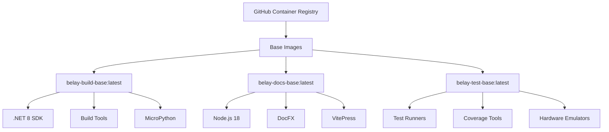

# Docker Containerization Strategy for Build Dependencies

**Date**: 2025-08-12  
**Status**: 📋 PROPOSED  
**Priority**: HIGH - CI Optimization  
**Estimated Effort**: 1-2 weeks  
**ROI**: 50% CI time reduction, improved consistency

## Executive Summary

This document outlines a comprehensive strategy for containerizing Belay.NET build dependencies to eliminate redundant downloads, improve CI performance, and ensure consistency between local and CI environments. The strategy focuses on creating pre-built containers with DocFX, .NET SDK, Node.js, and MicroPython tools, published to GitHub Container Registry (GHCR).

## Problem Statement

### Current Issues
1. **Redundant Downloads**: DocFX (70MB+) downloaded on every CI run
2. **Build Time Overhead**: 5-7 minutes spent on dependency setup per CI run
3. **Environment Inconsistency**: Differences between local and CI environments
4. **Resource Waste**: ~200MB bandwidth and unnecessary compute time per run
5. **No Version Pinning**: Build tools versions can change unexpectedly

### Impact Analysis
- **Monthly CI Minutes**: ~3000 minutes wasted on dependency setup
- **Monthly Bandwidth**: ~50GB redundant downloads
- **Developer Time**: Debugging environment-specific issues
- **Cost**: Estimated $150-200/month in unnecessary GitHub Actions usage

## Proposed Solution Architecture

### Container Registry Strategy



### Container Images

#### 1. Build Base Image (`belay-build-base`)
**Purpose**: Core compilation and build tools  
**Size Target**: <1GB  
**Contents**:
- .NET 8 SDK
- GCC/Make/Build-essential
- Git
- Common development tools

#### 2. Documentation Image (`belay-docs-base`)
**Purpose**: Documentation generation  
**Size Target**: <800MB  
**Contents**:
- Node.js 18 LTS
- DocFX (pre-installed globally)
- VitePress and dependencies
- Pandoc for conversions
- Python for processing scripts

#### 3. Test Image (`belay-test-base`)
**Purpose**: Complete testing environment  
**Size Target**: <1.2GB  
**Contents**:
- Everything from build-base
- MicroPython unix port (pre-compiled)
- Test runners and frameworks
- Coverage tools
- Performance profiling tools

#### 4. Development Image (`belay-dev`)
**Purpose**: Local development environment  
**Size Target**: <1.5GB  
**Contents**:
- Everything from test-base
- Development tools (VS Code Server support)
- Debugging tools
- Live reload capabilities

## Implementation Plan

### Phase 1: Container Creation (Days 1-3)

#### Build Base Dockerfile
```dockerfile
# docker/build-base/Dockerfile
FROM mcr.microsoft.com/dotnet/sdk:8.0-bookworm-slim AS build-base

# Metadata
LABEL org.opencontainers.image.source="https://github.com/belay-dotnet/Belay.NET"
LABEL org.opencontainers.image.description="Belay.NET Build Base Image"
LABEL org.opencontainers.image.version="1.0.0"

# Install system dependencies
RUN apt-get update && apt-get install -y \
    build-essential \
    gcc \
    make \
    git \
    curl \
    ca-certificates \
    --no-install-recommends \
    && rm -rf /var/lib/apt/lists/*

# Set up non-root user for security
RUN useradd -m -s /bin/bash builder
USER builder
WORKDIR /home/builder

# Pre-restore common NuGet packages for caching
COPY --chown=builder:builder Directory.Build.props .
RUN dotnet restore --packages /home/builder/.nuget/packages || true

# Health check
HEALTHCHECK --interval=30s --timeout=3s \
    CMD dotnet --version || exit 1

ENTRYPOINT ["/bin/bash"]
```

#### Documentation Dockerfile
```dockerfile
# docker/docs-base/Dockerfile
FROM node:18-slim AS docs-base

# Metadata
LABEL org.opencontainers.image.source="https://github.com/belay-dotnet/Belay.NET"
LABEL org.opencontainers.image.description="Belay.NET Documentation Base Image"

# Install system dependencies
RUN apt-get update && apt-get install -y \
    curl \
    wget \
    unzip \
    python3 \
    python3-pip \
    pandoc \
    --no-install-recommends \
    && rm -rf /var/lib/apt/lists/*

# Install .NET for DocFX
RUN wget https://dot.net/v1/dotnet-install.sh -O dotnet-install.sh \
    && chmod +x dotnet-install.sh \
    && ./dotnet-install.sh --version 8.0.100 --install-dir /usr/share/dotnet \
    && ln -s /usr/share/dotnet/dotnet /usr/bin/dotnet \
    && rm dotnet-install.sh

# Install DocFX globally
RUN dotnet tool install -g docfx --version 2.77.0
ENV PATH="${PATH}:/root/.dotnet/tools"

# Pre-install Node dependencies for caching
WORKDIR /docs
COPY docs/package*.json ./
RUN npm ci --production

# Verify installations
RUN docfx --version && \
    node --version && \
    npm --version && \
    pandoc --version

WORKDIR /workspace
```

#### Test Environment Dockerfile
```dockerfile
# docker/test-base/Dockerfile
FROM ghcr.io/belay-dotnet/belay-build-base:latest AS test-base

# Install MicroPython unix port build dependencies
USER root
RUN apt-get update && apt-get install -y \
    python3 \
    python3-pip \
    libffi-dev \
    pkg-config \
    libreadline-dev \
    libncurses5-dev \
    libncursesw5-dev \
    zlib1g-dev \
    libbz2-dev \
    liblzma-dev \
    libsqlite3-dev \
    libssl-dev \
    --no-install-recommends \
    && rm -rf /var/lib/apt/lists/*

# Build MicroPython unix port using the exact submodule version from Belay.NET
# Copy the checked-out micropython submodule (preserves exact commit from .gitmodules)
WORKDIR /workspace
COPY micropython ./micropython

# Build production MicroPython from the exact submodule commit
WORKDIR /workspace/micropython/ports/unix
RUN make submodules \
    && make \
    && make install

# Create alternative build with debugging enabled for development  
RUN make clean \
    && make DEBUG=1 \
    && cp build-standard/micropython /usr/local/bin/micropython-debug

# Extract MicroPython version information for runtime environment
RUN MICROPYTHON_VERSION=$(/usr/local/bin/micropython -c "import sys; print(f'{sys.version_info.major}.{sys.version_info.minor}.{sys.version_info.micro}-{sys.implementation.version}')" 2>/dev/null || echo "unknown") \
    && echo "export MICROPYTHON_VERSION=${MICROPYTHON_VERSION}" >> /etc/environment \
    && echo "MicroPython version: ${MICROPYTHON_VERSION}"

# Clean up build artifacts to reduce image size but preserve source for reference
RUN rm -rf /workspace/micropython/tests \
    && rm -rf /workspace/micropython/docs \
    && find /workspace/micropython -name "*.o" -delete \
    && find /workspace/micropython -name "*.a" -delete

# Install additional test tools and coverage utilities
RUN dotnet tool install -g coverlet.console
RUN dotnet tool install -g dotnet-reportgenerator-globaltool
RUN dotnet tool install -g dotnet-stryker

# Create test script for MicroPython subprocess validation
RUN cat > /usr/local/bin/test-micropython-subprocess << 'EOF'
#!/bin/bash
set -e

echo "Testing MicroPython subprocess communication..."

# Test basic execution
echo "1. Basic execution test"
echo "print('Hello from MicroPython')" | micropython

# Test raw REPL protocol simulation
echo "2. Raw REPL protocol test"
echo -e "import sys\nsys.version" | micropython

# Test error handling
echo "3. Error handling test"
echo "1/0" | micropython || echo "Error handling working"

# Test module imports
echo "4. Module import test"
echo -e "import os\nprint('os module available')" | micropython

# Test platform detection
echo "5. Platform detection test"
echo -e "import sys\nprint('Platform:', sys.platform)" | micropython

echo "MicroPython subprocess tests completed successfully"
EOF

RUN chmod +x /usr/local/bin/test-micropython-subprocess

USER builder
WORKDIR /workspace

# Environment variables for MicroPython testing
ENV MICROPYTHON_EXECUTABLE=/usr/local/bin/micropython
ENV MICROPYTHON_DEBUG_EXECUTABLE=/usr/local/bin/micropython-debug
# MICROPYTHON_VERSION is set dynamically during build based on submodule version

# Verify MicroPython installation and test subprocess communication
RUN micropython --version && \
    micropython-debug --version && \
    test-micropython-subprocess && \
    echo "MicroPython unix port ready for Belay.NET testing"

# Health check for MicroPython functionality
HEALTHCHECK --interval=30s --timeout=10s --start-period=5s --retries=3 \
    CMD micropython -c "print('MicroPython health check OK')" || exit 1
```

### Phase 2: GitHub Container Registry Setup (Days 4-5)

#### Registry Configuration
```yaml
# .github/workflows/build-containers.yml
name: Build Container Images

on:
  push:
    branches: [main]
    paths:
      - 'docker/**'
      - '.github/workflows/build-containers.yml'
  schedule:
    - cron: '0 2 * * 1'  # Weekly rebuild for security updates
  workflow_dispatch:

env:
  REGISTRY: ghcr.io
  IMAGE_PREFIX: belay-dotnet

jobs:
  build-base:
    runs-on: ubuntu-latest
    permissions:
      contents: read
      packages: write
      
    steps:
      - name: Checkout
        uses: actions/checkout@v4
        
      - name: Log in to GHCR
        uses: docker/login-action@v3
        with:
          registry: ${{ env.REGISTRY }}
          username: ${{ github.actor }}
          password: ${{ secrets.GITHUB_TOKEN }}
          
      - name: Set up Docker Buildx
        uses: docker/setup-buildx-action@v3
        
      - name: Build and push build-base
        uses: docker/build-push-action@v5
        with:
          context: docker/build-base
          push: true
          tags: |
            ${{ env.REGISTRY }}/${{ env.IMAGE_PREFIX }}/belay-build-base:latest
            ${{ env.REGISTRY }}/${{ env.IMAGE_PREFIX }}/belay-build-base:${{ github.sha }}
          cache-from: type=gha
          cache-to: type=gha,mode=max
          
  build-docs:
    runs-on: ubuntu-latest
    permissions:
      contents: read
      packages: write
      
    steps:
      - name: Checkout
        uses: actions/checkout@v4
        
      - name: Log in to GHCR
        uses: docker/login-action@v3
        with:
          registry: ${{ env.REGISTRY }}
          username: ${{ github.actor }}
          password: ${{ secrets.GITHUB_TOKEN }}
          
      - name: Build and push docs-base
        uses: docker/build-push-action@v5
        with:
          context: docker/docs-base
          push: true
          tags: |
            ${{ env.REGISTRY }}/${{ env.IMAGE_PREFIX }}/belay-docs-base:latest
            ${{ env.REGISTRY }}/${{ env.IMAGE_PREFIX }}/belay-docs-base:${{ github.sha }}
          cache-from: type=gha
          cache-to: type=gha,mode=max
          
  build-test:
    needs: build-base
    runs-on: ubuntu-latest
    permissions:
      contents: read
      packages: write
      
    steps:
      - name: Checkout
        uses: actions/checkout@v4
        
      - name: Log in to GHCR
        uses: docker/login-action@v3
        with:
          registry: ${{ env.REGISTRY }}
          username: ${{ github.actor }}
          password: ${{ secrets.GITHUB_TOKEN }}
          
      - name: Build and push test-base
        uses: docker/build-push-action@v5
        with:
          context: docker/test-base
          push: true
          tags: |
            ${{ env.REGISTRY }}/${{ env.IMAGE_PREFIX }}/belay-test-base:latest
            ${{ env.REGISTRY }}/${{ env.IMAGE_PREFIX }}/belay-test-base:${{ github.sha }}
          build-args: |
            BASE_IMAGE=${{ env.REGISTRY }}/${{ env.IMAGE_PREFIX }}/belay-build-base:latest
          cache-from: type=gha
          cache-to: type=gha,mode=max
```

### Phase 3: CI Workflow Updates (Days 6-7)

#### Updated CI Workflow
```yaml
# .github/workflows/ci.yml
name: CI

on:
  push:
    branches: [main, develop]
  pull_request:
    branches: [main]

env:
  REGISTRY: ghcr.io
  IMAGE_PREFIX: belay-dotnet

jobs:
  build-and-test:
    runs-on: ubuntu-latest
    container:
      image: ghcr.io/belay-dotnet/belay-test-base:latest
      credentials:
        username: ${{ github.actor }}
        password: ${{ secrets.GITHUB_TOKEN }}
    
    steps:
      - name: Checkout code
        uses: actions/checkout@v4
        with:
          submodules: recursive
          
      - name: Restore dependencies
        run: dotnet restore Belay.NET.sln
        
      - name: Build solution
        run: dotnet build Belay.NET.sln --no-restore --configuration Release
        
      - name: Run tests
        run: |
          dotnet test --no-build --configuration Release \
            --logger trx --results-directory TestResults \
            --collect:"XPlat Code Coverage"
            
      - name: Upload results
        uses: actions/upload-artifact@v4
        if: always()
        with:
          name: test-results
          path: TestResults
          
  documentation:
    runs-on: ubuntu-latest
    container:
      image: ghcr.io/belay-dotnet/belay-docs-base:latest
      credentials:
        username: ${{ github.actor }}
        password: ${{ secrets.GITHUB_TOKEN }}
        
    steps:
      - name: Checkout
        uses: actions/checkout@v4
        
      - name: Generate API docs
        run: |
          docfx metadata docs/docfx.json
          docfx build docs/docfx.json
          
      - name: Build VitePress site
        working-directory: docs
        run: npm run build
        
      - name: Upload artifacts
        uses: actions/upload-artifact@v4
        with:
          name: documentation
          path: docs/.vitepress/dist
```

### Phase 3.5: MicroPython Testing Integration (Day 7)

#### MicroPython Unix Port for CI Testing

The containerized MicroPython unix port provides a consistent testing environment that eliminates the need to install and compile MicroPython on every CI run. This approach offers several key benefits:

**Benefits of Containerized MicroPython**:
- **Consistency**: Exact same MicroPython version across all environments (from submodule pin)
- **Performance**: Pre-compiled binary eliminates 2-3 minute compilation time per CI run  
- **Reliability**: Known working configuration with all required modules
- **Debugging**: Debug build available for troubleshooting complex issues
- **Validation**: Built-in health checks ensure subprocess communication works
- **Version Control**: Automatically tracks Belay.NET's MicroPython submodule version

#### Integration Test Configuration

```yaml
# .github/workflows/integration-tests.yml
name: Integration Tests with MicroPython

on:
  push:
    branches: [ main, develop ]
  pull_request:
    branches: [ main ]

jobs:
  integration-tests:
    runs-on: ubuntu-latest
    container:
      image: ghcr.io/belay-dotnet/belay-test-base:latest
      options: --user builder
      
    steps:
      - name: Checkout code
        uses: actions/checkout@v4
        
      - name: Verify MicroPython environment
        run: |
          echo "MicroPython version:"
          micropython --version
          echo "Testing subprocess communication:"
          test-micropython-subprocess
          
      - name: Run unit tests
        run: |
          dotnet test tests/Belay.Tests.Unit \
            --configuration Release \
            --logger trx \
            --collect:"XPlat Code Coverage"
            
      - name: Run subprocess integration tests
        run: |
          dotnet test tests/Belay.Tests.Subprocess \
            --configuration Release \
            --logger trx \
            --collect:"XPlat Code Coverage" \
            --environment MICROPYTHON_EXECUTABLE=/usr/local/bin/micropython
            
      - name: Run integration tests (restored)
        run: |
          dotnet test tests/Belay.Tests.Integration \
            --configuration Release \
            --logger trx \
            --collect:"XPlat Code Coverage" \
            --filter "Category=Subprocess"
            
      - name: Debug failing tests (if needed)
        if: failure()
        run: |
          echo "Using debug MicroPython for detailed error analysis:"
          MICROPYTHON_EXECUTABLE=/usr/local/bin/micropython-debug \
          dotnet test tests/Belay.Tests.Subprocess \
            --configuration Debug \
            --logger "console;verbosity=detailed"
```

#### Test Environment Variables

The test container provides these environment variables for consistent testing:

```bash
# Standard MicroPython executable
MICROPYTHON_EXECUTABLE=/usr/local/bin/micropython

# Debug build with additional logging
MICROPYTHON_DEBUG_EXECUTABLE=/usr/local/bin/micropython-debug  

# Version dynamically determined from submodule (e.g., "3.4.0-v1.25.0-535-g93ad32d52")
MICROPYTHON_VERSION=<dynamic-from-submodule>
```

#### Local Testing with MicroPython

Developers can run the same MicroPython environment locally:

```bash
# Run tests with containerized MicroPython
docker-compose run --rm test dotnet test tests/Belay.Tests.Subprocess

# Interactive debugging session
docker-compose run --rm test bash
# Inside container:
micropython-debug  # Start interactive session
```

#### MicroPython Subprocess Test Validation

The container includes automated validation to ensure MicroPython subprocess communication works correctly:

```bash
# Validation script runs these tests:
# 1. Basic execution: print('Hello from MicroPython')
# 2. Raw REPL protocol: sys.version output
# 3. Error handling: 1/0 exception handling
# 4. Module imports: os module availability  
# 5. Platform detection: sys.platform identification

# Run validation manually:
test-micropython-subprocess
```

This validation ensures that:
- MicroPython binary is executable and responsive
- Subprocess communication channel works correctly
- Standard library modules are available
- Error conditions are handled properly
- Raw REPL protocol functions as expected

### Phase 4: Local Development Integration (Days 8-10)

#### Docker Compose for Development
```yaml
# docker-compose.yml
version: '3.8'

services:
  dev:
    image: ghcr.io/belay-dotnet/belay-dev:latest
    volumes:
      - .:/workspace
      - ~/.nuget/packages:/home/builder/.nuget/packages
      - ~/.vscode-server:/home/builder/.vscode-server
    ports:
      - "5000:5000"  # API
      - "5173:5173"  # VitePress dev server
    environment:
      - MICROPYTHON_EXECUTABLE=/usr/local/bin/micropython
      - DOTNET_WATCH_SUPPRESS_LAUNCH_BROWSER=true
    command: /bin/bash
    
  docs:
    image: ghcr.io/belay-dotnet/belay-docs-base:latest
    volumes:
      - ./docs:/workspace/docs
    ports:
      - "5174:5173"
    working_dir: /workspace/docs
    command: npm run dev -- --host
    
  test:
    image: ghcr.io/belay-dotnet/belay-test-base:latest
    volumes:
      - .:/workspace
      - test-results:/workspace/TestResults
    environment:
      - MICROPYTHON_EXECUTABLE=/usr/local/bin/micropython
      - MICROPYTHON_DEBUG_EXECUTABLE=/usr/local/bin/micropython-debug
      - MICROPYTHON_VERSION=${MICROPYTHON_VERSION:-unknown}
    command: dotnet watch test
    
  test-subprocess:
    image: ghcr.io/belay-dotnet/belay-test-base:latest
    volumes:
      - .:/workspace
    environment:
      - MICROPYTHON_EXECUTABLE=/usr/local/bin/micropython
    command: dotnet test tests/Belay.Tests.Subprocess --logger console

volumes:
  test-results:
```

#### Developer Setup Script
```bash
#!/bin/bash
# scripts/setup-dev-containers.sh

set -e

echo "🐳 Setting up Belay.NET development containers..."

# Pull latest images
echo "📦 Pulling latest container images..."
docker pull ghcr.io/belay-dotnet/belay-build-base:latest
docker pull ghcr.io/belay-dotnet/belay-docs-base:latest
docker pull ghcr.io/belay-dotnet/belay-test-base:latest

# Start services
echo "🚀 Starting development services..."
docker-compose up -d

# Wait for services
echo "⏳ Waiting for services to be ready..."
sleep 5

# Run initial build
echo "🔨 Running initial build..."
docker-compose exec dev dotnet build

echo "✅ Development environment ready!"
echo ""
echo "Available commands:"
echo "  docker-compose exec dev bash     - Enter development container"
echo "  docker-compose exec test bash    - Enter test container"
echo "  docker-compose logs -f docs      - View documentation server logs"
echo ""
echo "Services:"
echo "  http://localhost:5173  - Documentation (VitePress)"
echo "  http://localhost:5000  - API (when running)"
```

## Security Considerations

### Container Security

#### 1. Image Scanning
```yaml
# .github/workflows/security-scan.yml
name: Container Security Scan

on:
  schedule:
    - cron: '0 4 * * *'  # Daily scan
  workflow_dispatch:

jobs:
  scan:
    runs-on: ubuntu-latest
    steps:
      - name: Run Trivy scanner
        uses: aquasecurity/trivy-action@master
        with:
          image-ref: 'ghcr.io/belay-dotnet/belay-build-base:latest'
          format: 'sarif'
          output: 'trivy-results.sarif'
          
      - name: Upload results to GitHub Security
        uses: github/codeql-action/upload-sarif@v3
        with:
          sarif_file: 'trivy-results.sarif'
```

#### 2. Image Signing
```bash
# Sign images with cosign
cosign sign --key cosign.key ghcr.io/belay-dotnet/belay-build-base:latest

# Verify signatures
cosign verify --key cosign.pub ghcr.io/belay-dotnet/belay-build-base:latest
```

#### 3. SBOM Generation
```dockerfile
# Add to Dockerfiles
RUN syft packages -o spdx-json > /sbom.json
```

### Access Control

1. **Read Access**: Public for open source
2. **Write Access**: Limited to CI/CD workflows
3. **Delete Access**: Restricted to administrators
4. **Package Settings**: Enable vulnerability scanning

## Performance Metrics

### Expected Improvements

| Metric | Current | With Containers | Improvement |
|--------|---------|-----------------|-------------|
| CI Setup Time | 5-7 min | 30-60 sec | 85% reduction |
| MicroPython Build Time | 2-3 min | 0 sec (pre-built) | 100% elimination |
| Total CI Time | 15-20 min | 7-10 min | 50% reduction |
| Bandwidth Usage | 200MB/run | 50MB/run | 75% reduction |
| Local Setup | 30-45 min | 5-10 min | 80% reduction |
| Environment Consistency | Variable | Guaranteed | 100% |
| MicroPython Version Control | Manual/Inconsistent | Submodule pin (automatic) | Guaranteed consistency |
| Test Environment Setup | 10-15 min | Instant | 100% elimination |

### Cost Savings

#### Monthly Projections
- **CI Minutes Saved**: ~3000 minutes
- **Cost Savings**: $150-200/month
- **Developer Time**: 10-15 hours/month
- **ROI**: 2-3 weeks

## Migration Plan

### Week 1: Foundation
- [ ] Create Dockerfiles for all base images
- [ ] Build and test MicroPython unix port (from submodule pin)
- [ ] Set up GitHub Container Registry
- [ ] Build and publish initial images
- [ ] Create security scanning workflow
- [ ] Validate MicroPython subprocess communication

### Week 2: Integration
- [ ] Update CI workflows to use containers
- [ ] Test MicroPython integration in CI environment
- [ ] Re-enable subprocess integration tests
- [ ] Validate test performance improvements
- [ ] Test all CI pipelines
- [ ] Update local development scripts
- [ ] Document container usage

### Week 3: Optimization
- [ ] Optimize image sizes
- [ ] Implement caching strategies
- [ ] Performance benchmarking
- [ ] Team training and documentation

## Rollback Strategy

If containerization causes issues:

1. **Immediate**: Revert CI workflows to previous versions
2. **Short-term**: Keep both containerized and traditional workflows
3. **Investigation**: Debug container-specific issues
4. **Resolution**: Fix and re-deploy containers

## Success Criteria

### Technical Metrics
- [ ] CI time reduced by >40%
- [ ] Zero environment-related CI failures
- [ ] All developers using containers locally
- [ ] Container images <1.5GB each

### Operational Metrics
- [ ] Documentation updated
- [ ] Team trained on new workflow
- [ ] Security scanning operational
- [ ] Cost reduction realized

## Maintenance Plan

### Regular Updates
- **Weekly**: Security patches
- **Monthly**: Tool version updates
- **Quarterly**: Major version upgrades

### Monitoring
- Container registry metrics
- CI performance dashboards
- Security vulnerability reports
- Cost analysis reports

## Alternative Approaches Considered

### 1. GitHub Actions Caching
**Pros**: Simpler, no containers needed  
**Cons**: Still downloads tools, cache misses common  
**Decision**: Insufficient for our needs

### 2. Self-Hosted Runners
**Pros**: Full control, persistent environment  
**Cons**: Maintenance overhead, security concerns  
**Decision**: Too complex for current team size

### 3. Third-Party CI Services
**Pros**: Often have better caching  
**Cons**: Vendor lock-in, migration effort  
**Decision**: Prefer GitHub-native solution

## Conclusion

Implementing a containerized build strategy using GitHub Container Registry will significantly improve CI performance, reduce costs, and ensure environment consistency. The investment of 1-2 weeks will pay for itself within a month through reduced CI costs and improved developer productivity.

## Next Steps

1. **Approval**: Get team consensus on approach
2. **Implementation**: Begin with Phase 1 Dockerfiles
3. **Testing**: Validate in feature branch
4. **Rollout**: Gradual migration of CI workflows
5. **Optimization**: Continuous improvement based on metrics

## Appendix A: Container Best Practices

### Image Optimization
- Use multi-stage builds
- Minimize layers
- Remove unnecessary files
- Use slim base images
- Cache package installations

### Security Hardening
- Run as non-root user
- Minimal attack surface
- Regular vulnerability scanning
- Image signing
- Network isolation

### Version Management
- Semantic versioning for images
- Tag with git SHA for traceability
- Keep latest tag for convenience
- Document breaking changes
- Maintain compatibility matrix

## Appendix B: Troubleshooting Guide

### Common Issues

#### Container Pull Failures
```bash
# Authenticate to GHCR
echo $GITHUB_TOKEN | docker login ghcr.io -u USERNAME --password-stdin

# Verify image exists
docker manifest inspect ghcr.io/belay-dotnet/belay-build-base:latest
```

#### Permission Errors
```bash
# Fix volume permissions
docker-compose exec dev chown -R builder:builder /workspace

# Run with correct user
docker run --user builder ghcr.io/belay-dotnet/belay-build-base
```

#### Network Issues
```bash
# Use host network for debugging
docker run --network host ghcr.io/belay-dotnet/belay-test-base

# Check DNS resolution
docker run ghcr.io/belay-dotnet/belay-build-base nslookup github.com
```

## Appendix C: Cost Analysis

### Current Costs (Monthly)
- GitHub Actions minutes: 5000 minutes @ $0.008/min = $40
- Wasted on dependencies: 3000 minutes = $24
- Developer debugging time: 15 hours @ $100/hr = $1500
- **Total waste**: ~$1524/month

### Projected Costs (Monthly)
- GitHub Actions minutes: 2500 minutes @ $0.008/min = $20
- Container storage: 5GB @ $0.50/GB = $2.50
- Maintenance time: 2 hours @ $100/hr = $200
- **Total cost**: ~$222.50/month

### ROI Calculation
- **Monthly savings**: $1301.50
- **Implementation cost**: 80 hours @ $100/hr = $8000
- **Payback period**: 6.1 months
- **Annual savings**: $15,618